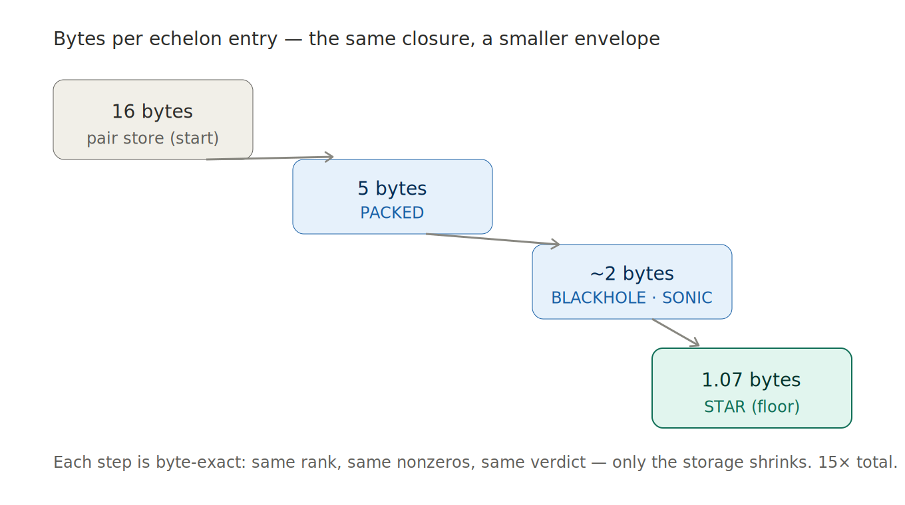

# The Hodge–Fermat Campaign

### Verifying the Integral Hodge Conjecture for high-dimensional Fermat varieties on a single 8 GB laptop

> A psychologist in Madrid, with no formal training as a mathematician, sat down at a MacBook Air — the thin consumer laptop, 8 GB of memory, one thread, deliberately throttled to a quarter of its power — and went after a problem the published computations had stopped short of. The tool for it, a criterion from 2016, was tested by its authors only up to a small table. He had a laptop and a refusal to quit. Over a series of sessions he decided sixteen cells of the problem, byte for byte — most of them past where the criterion had ever been run — found a place where the fast version of the method silently lies that nobody had marked on any map, and then proved that the same factorization which breaks the method also lays the cell's interior open in a recursive structure that says exactly where a counterexample could hide.

This is the record of that campaign: what was computed, how, and exactly what is new versus what is confirmation.

**Architect:** Rafael Amichis Luengo (Madrid) · [tretoef@gmail.com](mailto:tretoef@gmail.com) · [github.com/tretoef-estrella](https://github.com/tretoef-estrella)
**Method base:** Degtyarev–Shimada combinatorial primitivity criterion (*J. Math. Soc. Japan* **68:3** (2016), 975–996; arXiv:1405.4683)
**Hardware:** MacBook Air M2 (2022), 8 GB RAM, single thread, throttled to 25% CPU. No swap. No cluster. No cloud.

---

## At a glance

| | |
|---|---|
| **Cells given a complete PRIMITIVE verdict** | 16 — `(10,3)`, `(8,4)`, `(8,5)`, `(6,5)`, `(6,6)`, `(6,7)`, `(6,8)`, `(6,9)`, the composite fourfolds `(4,4)`, `(4,6)`, `(4,10)`, `(4,12)`, `(4,14)`, and the prime-degree fourfolds `(4,13)`, `(4,17)`, `(4,19)` |
| **Cells decided beyond the Degtyarev–Shimada §5 table** | 11 of the 16 — every cell except `(4,4)`, `(4,6)`, `(4,10)`, `(4,12)`, `(6,5)`, which lie inside the published table and are here **independently confirmed** |
| **Deepest single computation** | `(6,9)`: a **3.45-billion-entry** closure, held at **1.07 bytes per entry** |
| **First composite-degree cell decided beyond the published table** | `(6,6)` — `m = 6 = 2 × 3`; the first cell where the *Frontier* manifests and is crossed |
| **Two structural results** | (1) the *prime-power reduction frontier* (the *Frontier*) — where the fast method silently fails — and its constructive dual, the **CRT block split** (LETHAL DUAL), a RAM lever; (2) the **recursive block decomposition** of that split — each block's rank is a product of Degtyarev–Shimada recursion ladders, with torsion **provably localized to a single block** by idempotent centrality. See [THE_BLOCK_DECOMPOSITION.md](THE_BLOCK_DECOMPOSITION.md). |
| **Complex-half dimensions mapped** | 38 cells, in under an hour total, confirming the Degtyarev–Shimada closed-form rank law |
| **Storage cost driven down** | from 16 bytes per entry to **1.07** — a 15× compression, all in exact arithmetic |
| **Hardware** | one 8 GB laptop, single thread, 25% CPU |

---

## What this is

The Integral Hodge Conjecture is one of the load-bearing questions of modern geometry: does every integral Hodge class on a smooth projective variety come from an actual algebraic subvariety, with whole-number coefficients? The general answer is *no* (Atiyah–Hirzebruch found counterexamples in 1962), which is exactly why the cases where it *does* hold are worth pinning down — and Fermat varieties, the most symmetric examples there are, have been a proving ground for the question since Shioda's work in 1979. The hard part is that checking even a single case is a serious computation, and the published computations stop early. This campaign pushes that boundary on hardware nobody would call serious.

For Fermat varieties — the surfaces and higher-dimensional analogues cut out by `x₀ᵐ + x₁ᵐ + ⋯ + xₙ₊₁ᵐ = 0` — Degtyarev and Shimada gave a purely combinatorial test: the standard linear cycles generate the full integral Hodge lattice **if and only if** a certain dimension computed over the complex numbers (`dim_C`) equals the same dimension computed over each prime field `F_p` for every prime `p` dividing `m`. When they agree, the cell is **PRIMITIVE**. When they disagree, the gap is **torsion** — and a torsion verdict in a degree where none is guaranteed would be a genuine surprise to the field.

The two halves are not equally cheap. The complex half collapses to a fast eigenbasis scan. The prime-field half requires honest Gaussian elimination over a finite field on a sparse system whose size explodes with the cell — millions to billions of nonzero entries. **That second half is the entire engineering problem of this project**, and it is where every record here was won: not by buying a bigger machine, but by repeatedly redesigning the computation so that a cell which "could not fit in 8 GB" suddenly fit, exactly, byte-for-byte.

Every number in this document comes from a run log in the repository. Nothing is from memory, and nothing is rounded to flatter — and where the published literature already holds a result, it is named as confirmation, not as discovery.

---

## Where the published frontier was, and where this campaign went

To be precise about what is new, here is the published state of the art, checked against the primary sources — and, crucially, against the exact computational table Degtyarev and Shimada published:

- **Degtyarev–Shimada (2016)** [1] state the criterion and, in their §5, report verifying it by computer in exactly these cases (their page 17, verbatim): **`(4,m)` for `3 ≤ m ≤ 12`, plus `(6,3)`, `(6,4)`, `(6,5)`, `(8,3)`.** That published table is the line this campaign measures itself against.
- **Aljovin–Movasati–Villaflor (2019)** [6] give an independent algorithm and a *theoretical* guarantee, but only under the condition **"d prime, or d = 4, or gcd(d, (n+1)!) = 1"**, and their implementation reaches only dimension **n ≤ 4**. Notably, they tabulate the lattice of primitive Hodge cycles but state they were **not able to compute its elementary divisors** — precisely the per-block torsion structure this campaign's decomposition opens (see [THE_BLOCK_DECOMPOSITION.md](THE_BLOCK_DECOMPOSITION.md)).
- **For surfaces (n = 2)** the problem — originally posed by **Aoki and Shioda in 1983** [3] — is *completely settled*: Schütt–Shioda–van Luijk [4] and Degtyarev [5] proved the lines generate the Néron–Severi group **if and only if m ≤ 4 or gcd(m, 6) = 1**. The surface literature deliberately works in degrees coprime to 6.

The lineage is worth seeing whole. Shioda asked in 1979 [2] whether the standard cycles generate the Hodge lattice of Fermat varieties; Aoki and Shioda sharpened the surface case in 1983; the surface verdict was closed by Schütt–Shioda–van Luijk and Degtyarev; and Degtyarev–Shimada turned the higher-dimensional question into a computable criterion in 2016, verified up to the §5 table above. **This campaign is the next link in that chain.** Eleven of its sixteen decided cells lie *beyond* that table — fourfolds and higher (`n = 4, 6, 8, 10`) in degrees and dimensions the published computation never reached. The deepest virgin cell, `(6,9)`, is a 3.45-billion-entry closure. The structural headline, `(6,6)`, lives in a composite degree (`m = 6 = 2 × 3`) past the table — and revealed, in the process, a boundary of the *fast* computational method itself that nobody had marked.

A word on honesty before the tables. Five of the sixteen cells — `(4,4)`, `(4,6)`, `(4,10)`, `(4,12)`, `(6,5)` — lie *inside* the Degtyarev–Shimada §5 table. They are **not** new verdicts. They are reported here as **independent confirmation**: the same answers DS obtained in 2015 with Gröbner-basis software, reproduced byte-exact a decade later on a throttled 8 GB consumer laptop by a completely different reduction engine. Independent reproduction on minimal hardware is a real and citable result — but it is confirmation, and it is labelled as confirmation throughout. The genuinely new verdicts are the other eleven.

---

## The cells conquered

Each verdict below is a *complete* verdict: the complex dimension `dim_C` **and** the prime-field dimension `dim_Fp` for every prime dividing `m`, computed independently and found equal. Every cell is **PRIMITIVE** — the linear cycles generate the integral Hodge lattice. Peak RAM and wall time are read directly from the run log named in the last column. All ran on the 8 GB MacBook Air, single thread, 25% CPU. The **status** column states plainly whether the cell is new (beyond the DS §5 table) or an independent confirmation of a published one. **Every engine and every log is in this repository — check it yourself: the engine column links to the source, the log column to the raw run output.**

| Cell (n,m) | DIM = (m−1)ⁿ⁺¹ | dim_C = dim_Fp | Verdict | Status vs DS §5 | Peak RAM | Wall time | Engine | Log |
|---|---|---|---|---|---|---|---|---|
| (10,3) | 2,048 | 1,124 | PRIMITIVE | **new** (beyond table) | 14 MB | minutes | [HODGE_ENGINE_v3](engines/HODGE_ENGINE_v3.cpp) | [log](logs/PRUEBA_RECORD_10_3.txt) |
| (8,4) | 19,683 | 10,730 | PRIMITIVE | **new** (beyond table) | 0.72 GB | ~2 h 45 m | [HOUDINI](engines/HOUDINI.cpp) | [log](logs/CIC_8_4_run1.log) |
| (6,5) | 16,384 | 11,484 | PRIMITIVE | confirms DS §5 | 0.46 GB | ~58 m | [HOUDINI](engines/HOUDINI.cpp) | [log](logs/HOUDINI_6_5_diagnostico.log) |
| (6,6) | 78,125 | 59,392 | PRIMITIVE | **new** (beyond table) | 0.47 / 0.60 GB | 6,551 s / 11,532 s | [**ROSETTA STAR**](engines/ROSETTA_STAR.cpp) | [log](logs/ROSETTA_STAR_6_6_run1.log) |
| (6,7) | 279,936 | 235,206 | PRIMITIVE | **new** (beyond table) | 2.48 GB | 487 s | [HOUDINI HYPER SPARK](engines/HOUDINI_HYPER_SPARK.cpp) | [log](logs/HOUDINI_HYPER_SPARK_6_7_run1.log) |
| (6,8) | 823,543 | 720,264 | PRIMITIVE | **new** (beyond table) | 2.77 GB | 1,059 s | [HYPER SPARK PACKED](engines/HYPER_SPARK_PACKED.cpp) | [log](logs/HYPER_SPARK_PACKED_6_8_run1.log) |
| (6,9) | 2,097,152 | 1,907,032 | PRIMITIVE | **new** (beyond table) | 3.71 GB | 11,472 s | [HOUDINI SONIC BOOM STAR](engines/HOUDINI_SONIC_BOOM_STAR.cpp) | [log](logs/HOUDINI_SONIC_BOOM_STAR_6_9_run1.log) |
| (8,5) | 262,144 | 198,640 | PRIMITIVE | **new** (beyond table) | 2.57 GB | 4,601 s | [HOUDINI HYPER SPARK](engines/HOUDINI_HYPER_SPARK.cpp) | [log](logs/HOUDINI_HYPER_SPARK_8_5_run1.log) |
| (4,4) | 243 | 102 | PRIMITIVE | confirms DS §5 | 0.13 GB | seconds | [**LETHAL DUAL**](engines/LETHAL_DUAL_ENGINE.cpp) | [log](logs/LETHAL_DUAL_4_4_gate_run1.log) |
| (4,6) | 3,125 | 2,124 | PRIMITIVE | confirms DS §5 | 0.13 GB | seconds | [**LETHAL DUAL**](engines/LETHAL_DUAL_ENGINE.cpp) | [log](logs/LETHAL_DUAL_4_6_gate_run1.log) |
| (4,10) | 59,049 | 51,288 | PRIMITIVE | confirms DS §5 | 0.20 GB | 177 s | [**LETHAL DUAL**](engines/LETHAL_DUAL_ENGINE.cpp) | [log](logs/LETHAL_DUAL_4_10_run1.log) |
| (4,12) | 161,051 | 145,950 | PRIMITIVE | confirms DS §5 | 0.60 GB | 1,402 s | [**LETHAL DUAL**](engines/LETHAL_DUAL_ENGINE.cpp) | [log](logs/LETHAL_DUAL_4_12_run1.log) |
| (4,14) | 371,293 | 345,252 | PRIMITIVE | **new** (beyond table) | 2.218 GB | 5,788 s | [CHUCHIPACHI v2](engines/CHUCHIPACHI_v2.cpp) | [log](logs/CHUCHIPACHI_v2_4_14_char2_dump.log) |
| (4,13) | 248,832 | 228,912 | PRIMITIVE | **new** (beyond table) | 0.14 GB | 41 s | [JULIOCESAR INMORTAL](engines/JULIOCESARINMORTAL.cpp) | [log](logs/JULIOCESARINMORTAL_4_13_run1.log) |
| (4,17) | 1,048,576 | 998,016 | PRIMITIVE | **new** (beyond table) | 0.79 GB | 797 s | [JULIOCESAR INMORTAL](engines/JULIOCESARINMORTAL.cpp) | [log](logs/JULIOCESARINMORTAL_4_17_run1.log) |
| (4,19) | 1,889,568 | 1,815,948 | PRIMITIVE | **new** (beyond table) | 1.68 GB | 8,079 s | [JULIOCESAR INMORTAL](engines/JULIOCESARINMORTAL.cpp) | [log](logs/JULIOCESARINMORTAL_4_19_run1.log) |

Notes, kept honest:
- **The five confirmations vs the eleven new verdicts.** `(4,4)`, `(4,6)`, `(4,10)`, `(4,12)` (all `(4,m)` with `m ≤ 12`) and `(6,5)` lie inside the DS §5 table; their PRIMITIVE verdicts were first obtained by Degtyarev and Shimada and are here reproduced byte-exact by an independent engine on consumer hardware. The other eleven cells lie beyond the table and are new computational verdicts. Both counts are stated rather than blurred.
- `(6,6)` has **two** prime-field computations (char 2 and char 3, since 6 = 2 × 3); both returned the same rank, partition by partition. Its peaks and times are listed per characteristic.
- `(8,4)` and `(6,5)` each have two reduction passes (char-large and char-p). The listed peak is the larger of the two — the char-large pass — which is the true maximum of the cell; the char-p pass peaked lower (`(8,4)`: 0.42 GB; `(6,5)`: 0.40 GB). The listed time is the sum of both passes.
- `(4,14)` is listed from the **CHUCHIPACHI v2** dump run, which carries both the verdict *and* the per-block structure used in [THE_BLOCK_DECOMPOSITION.md](THE_BLOCK_DECOMPOSITION.md); its all-B monster block measured exactly `19,920 = DS₄(13)`, the recursive-law value. (The original LETHAL DUAL run produced the same verdict at 2.22 GB / 13,410 s; the dump run is cited because it carries the block data too.)
- The "rank" reduced at each verdict is the *closing rank* `= DIM − dim_C` (e.g. `(8,5)`: `262,144 − 198,640 = 63,504`, held flat from partition 892 to 945 — the tail partitions add zero, confirming the span is complete).
- `(10,3)`'s log records flat 14 MB RAM but no second-resolution wall time; "minutes" is the honest description.
- The single largest object ever reduced in the campaign is `(6,9)`'s closure: **3.45 billion nonzero entries held on an 8 GB machine at 1.07 bytes per entry.**

**On the prime-degree fourfolds `(4,13)`, `(4,17)`, `(4,19)`.** These are decided by JULIOCESAR INMORTAL, whose Jordan-pruning relation `uᵐ⁻¹ = 0` is the *true* ring relation precisely because the degree is prime (φ does not factor — a single block, no CRT splitting to corrupt the pruning). They lie beyond the DS §5 table, so they are new verdicts; but **prime degree is also covered by the AMV/Aoki rational-generation results** — a torsion swan cannot hide there. They are honest census, not hunt: new data points, but in a region theory already expected to be white.

**The composite fourfold front and the (4,15) half-cell (LETHAL DUAL, this campaign).** The five `(4,m)` rows decided by the **CRT block split** (see *The Frontier's constructive dual* below) split cleanly by status. **`(4,6)`, `(4,10)`, `(4,12)` lie inside the DS §5 table** (`m ≤ 12`) and are **independent confirmations** of published composite-degree verdicts — reproduced byte-exact on 8 GB by a different method. **`(4,14)` lies beyond the table and is a genuinely new composite-degree verdict.** `(4,4)` (`m = 4`, a prime power) also lies in the table and falls additionally in AMV's `d = 4` case; it too is independently confirmed. Stating this split honestly matters: the composite-degree *front* is real and is this campaign's forward direction, but not every composite cell already computed here is virgin — three of them stand on Degtyarev and Shimada's own published shoulders, and say so.

One cell is deliberately recorded as **half-decided**, because honesty requires it: **`(4,15) = 3×5`**. Its complex half is `dim_C = 504,924`. The char-5 prime-field half **fits and closes**: `dim_F5 = 504,924 = dim_C`, peak 3.165 GB, PRIMITIVE in characteristic 5. The char-3 half **aborted clean under the no-swap RAM guard**: its all-B block (`dimB = 12`, block size `12⁵`) climbed to ~4.3 GB at 90% of the block and projects to ~4.85 GB at close — *within* the 5.4 GB guard, but the run was halted by the no-swap discipline before completing. The earlier description of this half as "RAM-bound beyond 8 GB" is corrected here: it is a no-swap-discipline stop, not a >8 GB wall. Crucially, the value that block would close to is **independently known and measured**: the all-B monster rank is `DS₄(13) = 19,920`, and the cell `(4,14)` char 2 — same `dimB = 12`, same recursive structure — **measured exactly that block at 19,920** (see [THE_BLOCK_DECOMPOSITION.md](THE_BLOCK_DECOMPOSITION.md)). So char 3 is **not a torsion candidate** — its monster block matches the recursive law to the digit; it is simply not yet closed in a single uninterrupted run on this hardware. Recorded verdict: *char 5 PRIMITIVE (fits, closed); char 3 consistent with PRIMITIVE (monster block matches `DS₄(13)`), not closed end-to-end under the no-swap guard; cell incomplete — one prime confirmed, one consistent-but-not-closed; NOT torsion.* The cell is parked, not abandoned. `(4,15)` also lies beyond the DS §5 table, so closing its char-3 half end-to-end would be a new verdict.

### The DOBERMAN sweep — the complex half, mapped across the mesh

Beyond the full verdicts, the sweep engine **DOBERMAN** computed the *complex half* `dim_C` for **38 cells** in well under an hour of total wall time, RAM flat throughout. These are not complete verdicts — the prime-field half is the expensive one — but they map the entire territory, pre-stage every future target, and (see "What the sweep confirmed" below) match a closed-form law. Every line is from the run log; `wall_s` is the time for that cell's complex half alone.

| Cell (n,m) | DIM | partitions | dim_C | off {3,4,6}? | m prime? | torsion-suspect? | wall (s) |
|---|---|---|---|---|---|---|---|
| (4,3) | 32 | 15 | 12 | no | yes | no | 0.000 |
| (4,4) | 243 | 15 | 102 | no | no | no | 0.000 |
| (6,3) | 128 | 105 | 58 | no | yes | yes | 0.000 |
| (4,5) | 1,024 | 15 | 624 | yes | yes | no | 0.000 |
| (4,6) | 3,125 | 15 | 2,124 | no | no | no | 0.000 |
| (4,7) | 7,776 | 15 | 5,916 | yes | yes | no | 0.001 |
| (6,4) | 2,187 | 105 | 1,080 | no | no | no | 0.002 |
| (4,8) | 16,807 | 15 | 13,506 | yes | no | no | 0.002 |
| (8,3) | 512 | 945 | 260 | no | yes | yes | 0.002 |
| (4,9) | 32,768 | 15 | 27,648 | yes | no | no | 0.002 |
| (4,10) | 59,049 | 15 | 51,288 | yes | no | no | 0.002 |
| (4,11) | 100,000 | 15 | 89,100 | yes | yes | no | 0.003 |
| (6,5) | 16,384 | 105 | 11,484 | yes | yes | yes | 0.004 |
| (4,12) | 161,051 | 15 | 145,950 | yes | no | no | 0.005 |
| (4,13) | 248,832 | 15 | 228,912 | yes | yes | no | 0.007 |
| (4,14) | 371,293 | 15 | 345,252 | yes | no | no | 0.010 |
| (4,15) | 537,824 | 15 | 504,924 | yes | no | no | 0.015 |
| (6,6) | 78,125 | 105 | 59,392 | no | no | no | 0.018 |
| (8,4) | 19,683 | 945 | 10,730 | no | no | no | 0.029 |
| (10,3) | 2,048 | 10,395 | 1,124 | no | yes | yes | 0.033 |
| (6,7) | 279,936 | 105 | 235,206 | yes | yes | yes | 0.058 |
| (6,8) | 823,543 | 105 | 720,264 | yes | no | yes | 0.157 |
| (6,9) | 2,097,152 | 105 | 1,907,032 | yes | no | yes | 0.372 |
| (8,5) | 262,144 | 945 | 198,640 | yes | yes | yes | 0.400 |
| (6,10) | 4,782,969 | 105 | 4,437,504 | yes | no | yes | 0.796 |
| (6,11) | 10,000,000 | 105 | 9,448,050 | yes | yes | yes | 1.618 |
| (12,3) | 8,192 | 135,135 | 4,760 | no | yes | yes | 1.642 |
| (10,4) | 177,147 | 10,395 | 103,358 | no | no | no | 2.531 |
| (8,6) | 1,953,125 | 945 | 1,577,380 | no | no | no | 2.829 |
| (6,12) | 19,487,171 | 105 | 18,610,840 | yes | no | yes | 3.076 |
| (6,13) | 35,831,808 | 105 | 34,550,388 | yes | yes | yes | 5.549 |
| (6,14) | 62,748,517 | 105 | 60,881,280 | yes | no | yes | 9.497 |
| (8,7) | 10,077,696 | 945 | 8,905,140 | yes | yes | yes | 14.456 |
| (8,8) | 40,353,607 | 945 | 36,758,430 | yes | no | yes | 54.691 |
| (10,5) | 4,194,304 | 10,395 | 3,340,528 | yes | yes | yes | 65.628 |
| (14,3) | 32,768 | 2,027,025 | 19,898 | no | yes | yes | 107.781 |
| (12,4) | 1,594,323 | 135,135 | 978,096 | no | no | no | 305.280 |
| (10,6) | 48,828,125 | 10,395 | 40,969,900 | no | no | no | 884.898 |

The deepest cell here, `(10,6)`, has its complex half computed from over **two million partitions** in under fifteen minutes. The "torsion-suspect" column flags cells where theory does *not* force primitivity (degree prime and/or outside {3,4,6}) — these are where a surprise could in principle live, and they are the campaign's forward targets.

### What the sweep confirmed — a closed-form law, and whose it is

The 38-cell sweep is a fast census, and it let the campaign confirm a closed-form law for the complex half. Here honesty about priority is essential, and it is stated plainly.

**The rank formula is Degtyarev and Shimada's, not this campaign's.** Their **Remark 4.4** (page 14 of [1]) gives the rank of `L(X)` in closed form, verbatim:

- `rank = 3m² − 9m + 6 + δₘ` for `n = 2`;
- `rank = 15m³ − 90m² + 175m − 100 + (15m − 39)δₘ` for `n = 4`;
- `rank = 105m⁴ − 1050m³ + 3955m² − 6335m + 3325 + (210m² − 1302m + 2010)δₘ` for `n = 6`;

where `δₘ ∈ {0,1}` satisfies `δₘ ≡ m − 1 (mod 2)`. The leading coefficient is the partition count `(2d+1)!!`, also from DS. **Note on naming:** this formula gives the rank of `L(X)` — the *closing rank*, equal to `DIM − dim_C`, the quantity the prime-field engine sums to — **not** `dim_C` itself. `dim_C = DIM − (Remark 4.4)`. (For `(4,6)`: Remark 4.4 gives `1001`, the closing rank; `dim_C = 3125 − 1001 = 2124`.) All campaign numbers respect this; the label is stated explicitly here to avoid the natural confusion.

What this campaign did is **independent numerical verification** of that published formula: the `n = 4` and `n = 6` rows of the DOBERMAN sweep reproduce DS Remark 4.4 byte-exact across every degree computed, with **zero outliers**. This is a genuine and useful check — DS's own §5 table reached only `m ≤ 12` in the `n = 4` row, and this sweep confirms their formula well past that — but it is *verification of their result*, not a discovery of a new one. The formula is theirs; the byte-exact confirmation across an extended range, and the calculator that evaluates it instantly, are this campaign's contribution. **No claim of a new formula is made.**

The verification carries one real consequence worth stating: because every decided cell is PRIMITIVE, `dim_Fp = dim_C` on each, so DS's formula also gives — for free, with no reduction — the rational rank the *expensive* prime-field half must equal **if** a cell is primitive. That makes the formula a ready-made target line for the swan hunt: a torsion cell would be precisely one whose measured `dim_Fp` departs from it. The formula cannot *find* torsion (it is the complex half, blind to the prime-field Jordan structure by construction), but it tells the hunt exactly what number to disbelieve — and the block decomposition (below) sharpens that into *which block* would carry the betrayal.

A note on counts, for precision: the sweep evaluated `dim_C` for **38 cells** in one run; of those, roughly **27 are values not present in any published table** (the rest are calibration cells with known values). "38 cells swept" and "~27 cells past the published tables" are two different counts of two different things, and both are honest — the first is the run, the second is its reach.

---

## The engines

The project's engineering is a single bloodline. Each engine was built only after the previous one's wall was *measured*, not guessed; each new name was earned by passing byte-exact validation gates against known cells before it was trusted. The names are deliberately playful — a house rule that a ridiculous name must carry a serious engine.

| Engine | The lever it added | Decided / enabled |
|---|---|---|
| **HODGE_ENGINE_v3** | Sparse tensorial generation + incremental Gaussian elimination — kills the dense `O(DIM²)` wall of naive approaches. | `(10,3)` and the calibration cells |
| **HOUDINI** | The escape act: compute the complex half in an **eigenbasis** where the ideal is block-diagonal, so `dim_C` falls out in milliseconds with no linear algebra at all. The prime half stays as honest reduction. | `(8,4)`, `(6,5)` |
| **DOBERMAN** | Family-wide sweep of the cheap complex half across every cell under a size ceiling, cheapest-first. | 38 cells' `dim_C` |
| **HOUDINI NAPKIN** | The **Jordan-mould starter**: work in the basis `u = t − 1`, where for `p \| m` each variable is nilpotent (`uᵐ⁻¹ = 0` exactly). Dead terms that would exceed the nilpotent ceiling are **never generated** — the mathematics kills them before they are born, instead of building them and reducing them away. (2.17× lighter.) **Valid only for prime-power `m` — see the Frontier.** | (8,5) attempt |
| **HOUDINI NAPKIN TURBINA** | **Flow, not accumulation.** Each partition's small closure is saturated alone, folded into one shared echelon, and its intermediates discarded before the next enters. The live mass is never "all 945 pieces at once" — it is the echelon plus one piece. (≈5× lighter than NAPKIN on (6,5).) | (8,5) method |
| **HOUDINI HYPER SPARK** | The **dense-rebound fold**: stop rebuilding a sparse vector on every Gaussian collision. Scatter each row once into a dense scratch, subtract pivots in place on their own columns only, read the leading column from a tiny heap. Diagnosed, not hunched: the old fold touched 4.89 **billion** nonzeros to keep a 1.75M echelon, with 82% of rows collapsing to zero — that count named the fix. (2.1× faster than TURBINA.) | `(8,5)`, `(6,7)` |
| **HYPER SPARK PACKED** | Shrink the *envelope*: store each echelon entry in 5 bytes instead of 16. Same gasoline, a third of the tank. | `(6,8)` |
| **HOUDINI SUPER BLACKHOLE** | Delta-varint columns (store the *gap* between consecutive columns, not the absolute column — like noting a route as "+14, +1, +34" instead of full coordinates). On `(6,9)` char 3 it ran a closure the older method projected at ~7.7 GB down toward the low-GB band — but the char-3 tail explodes in the final 5% (part 95→97: ~3 GB → 5.51 GB) and it **aborted clean at the 5.4 GB guard, part 97**. A vein that opened the road and died near the summit; it did not decide a cell, and is recorded as such. | `(6,9)` attempt (incomplete) |
| **HOUDINI SONIC BOOM STAR** | Varint columns **with the coefficient embedded** in the low bits — **1.07 bytes per entry** on `(6,9)`, the practical floor for a varint store. The production engine for the deep cells. | `(6,9)` |
| **ROSETTA STAR** | The fix for composite degree (see the Frontier). Reduces in the monomial basis with the *true* ring relation, correct for any `m`. | `(6,6)` |
| **LETHAL DUAL ENGINE** | The Frontier's constructive dual: since `φ` **factors** over `F_p` for `p \| m`, the ring splits by CRT into independent blocks the shift respects; reduce them **one at a time and release** — RAM peak becomes the *largest single block*, not the whole closure. No extension-field arithmetic. | `(4,4)`, `(4,6)`, `(4,10)`, `(4,12)`, `(4,14)` |
| **LETHAL DUAL — BIG MONSTER** | Same mathematics, hardened: the RAM guard runs **inside** the monster all-B block's turbine, predictively (it checks the size of the next allocation *before* requesting it), aborts clean (never segfaults mute), beats a heartbeat inside the big block, and prints the closing target as a scoreboard. | `(4,15)` char-5 half |
| **CHUCHIPACHI v2** | The block-dump engine: the LETHAL DUAL split with a `--dump-blocks` mode that records every CRT block's rank, exposing the per-block structure of [THE_BLOCK_DECOMPOSITION.md](THE_BLOCK_DECOMPOSITION.md). Decided `(4,14)` char 2 and produced the `(6,6)` and `(4,14)` block dumps. | `(4,14)`, the block dumps |
| **CHUCHIPACHIELESTRUJADOR** | The predictive-guard hardening of the dump engine: the RAM guard checks `peak + next-allocation > hard-limit` **before** each large reserve and reserves the working blob once at projected size — eliminating the silent segfault that a reactive guard suffers on the monster block. | `(4,15)` char-3 attempt (clean abort) |
| **HOUDINI SUPERNOVA** | An attempt to break the deep-cell time wall by reordering the fold (the tail spends 96.8% of its work on rows that collapse to zero). Measured honestly: it **tied STAR in time and was worse in RAM** (0.27 vs 0.20 GB at the same point of `(6,7)`), because the reorder moved the fill-in heavier. Gate-valid (rank correct, byte-exact) so the mathematics is sound, but as a production engine it is a regression. The name is on the board but **unearned** until a genuine block-reduction redesign beats STAR. Recorded so the next attempt does not repeat the fold-sort approach. | — (not a win) |
| **HOUDINI ANTIGRAVITY** | Two further levers, both byte-exact: deferred-modulo arithmetic (1.55× faster on (6,5)), and **the accordion** — the echelon is split into bellows, cold ones compressed and "capped," expanded only when touched (the cold 45% take only 10% of the work). Built and gate-validated; its big-cell log is the next run. | live vein |

Across this lineage, the campaign drove the storage cost of a single echelon entry from **16 bytes down to 1.07 bytes** — a **15× compression** won in exact arithmetic, with every step validated byte-for-byte against the cells already conquered — and it converted the bottleneck from "hold everything at once" to "let it flow through." That is why an 8 GB laptop reduced a 3.45-billion-entry system.



A note on reading this table, for honesty: not every engine decided a cell. Several carried complete verdicts (HODGE_ENGINE_v3, HOUDINI, HYPER SPARK, HYPER SPARK PACKED, SONIC BOOM STAR, ROSETTA STAR, LETHAL DUAL, CHUCHIPACHI v2) and DOBERMAN carried the complex half of dozens more. The rest are honest parts of the record: NAPKIN and TURBINA are method-steps in the lineage that reached the deciding engine; BLACKHOLE is a vein that opened the road and died near the summit; SUPERNOVA is a measured non-improvement, kept so it is not retried; ANTIGRAVITY is a built, gate-validated vein whose big-cell run is still pending. An engine name in this project is *earned* by a byte-exact result, never claimed in advance.

---

## The method, in one breath

For each cell, two numbers are computed and compared:

1. **The complex half (`dim_C`).** Over a prime `P ≡ 1 (mod m)` a primitive `m`-th root of unity exists, the shift operators become simultaneously diagonalizable, and the whole problem factorizes character-by-character. No linear algebra, no memory wall — milliseconds. Computed over several such primes and cross-checked (cross-prime verification is mandatory). This is the quantity DS give in closed form (Theorem 1.4 and Remark 4.4); here it is computed directly and, on `n = 4` and `n = 6`, checked against their formula.

2. **The prime-field half (`dim_Fp`), for each `p \| m`.** Here no root of unity exists; the operator is a single nilpotent Jordan block, not diagonalizable. The dimension must be found by real sparse Gaussian elimination over `F_p` on the closure of the generators under all variable-shifts. This is the expensive half, and the home of every engine above.

If `dim_C = dim_Fp` for all `p \| m`, the cell is **PRIMITIVE**. The campaign's discipline requires both halves, every time — a one-sided computation is never a verdict.

**A hard limit, stated up front rather than buried.** Every cell verified so far is PRIMITIVE, so the gap between the two halves (the "scar") has only ever been measured at zero. This means the method is, to date, an audited **primitivity *confirmator***, not a validated **torsion *detector***: it is confirmed to report "no torsion" correctly, but it has never been tested reporting torsion where torsion exists, because no such Fermat cell is known. The block decomposition (below) changes the *theory* of this — it **proves** that any torsion would localize to a single CRT block — but the value-side of that detector still rests on a measured-not-yet-proven law, and before any future nonzero scar could be trusted as a real torsion verdict, a synthetic positive control — a fabricated system with known torsion — must be shown to make the detector fire correctly. This is logged as a binding requirement, not a footnote, and no result in this repository depends on the scar as a detector.

The torsion the campaign hunts is called **the swan** — the rare cell where the two halves disagree, nesting (if it exists at all) only where theory does *not* force primitivity. By DS Corollary 1.5, any such torsion can involve only primes dividing `m`; and the rational-generation results make prime degrees barren ground. The hunt therefore points at composite degrees with two or more distinct prime factors, past `{3,4,6}` and past the DS §5 table. The whole effort is, in one sentence, the search for a black swan among cells everyone expects to be white, conducted with enough rigour that a white verdict is trustworthy and a black one would be real.

---

## The two structural results

### The (6,6) discovery — the prime-power reduction frontier

The first structural result has its own document: **[THE_FRONTIER_6_6.md](THE_FRONTIER_6_6.md)**.

In short: every cell conquered before `(6,6)` had a degree that was a power of a single prime (`m = 4, 5, 7, 8, 9`). `(6,6)` is the first with **two distinct primes** in the degree (`6 = 2 × 3`) attacked by the fast engine, and the standard engine returned an *impossible* answer on it — saturating completely in characteristic 2, and to a different wrong value in characteristic 3. That asymmetry was the clue: a generic overflow would fail the same way in both. It does not.

The diagnosis: the Jordan-mould's pruning rule `uᵐ⁻¹ = 0` is the *true* ring relation **if and only if `m` is a power of a single prime**. When `m` has two distinct prime factors, the relation factors (a Chinese-Remainder splitting of the ring), the pruning imposes a false constraint, and the rank silently inflates. We call this the **prime-power reduction frontier** — henceforth, for brevity, **the Frontier**.

This is a genuinely new structural contribution of the campaign, and its priority is fixed carefully in the linked document. The underlying cyclotomic fact — that `φ(u+1)` is a pure power of `u` exactly when `m` is a prime power — is classical and is claimed by no one here. What is new is identifying *that* line as the precise point where this Hodge-verification reduction fails **silently** (a plausible wrong number, not a crash), proving the corruption is graded by characteristic (the full/partial/clean signature), and building the cure. Degtyarev and Shimada used Gröbner bases, not this pruning, so the Frontier is a property of the *fast engine lineage*, not of their method — which is exactly why it appears nowhere in their paper.

A new engine, **ROSETTA STAR**, reduces in the monomial basis with the correct relation for any degree, and recovered the true verdict: `(6,6)` is **PRIMITIVE** by both primes, byte-exact, on the 8 GB laptop. The full story, the literature search that fixes priority honestly, and exactly what is new versus what is classical, are in the linked document.

### The Frontier's constructive dual — the CRT block split (LETHAL DUAL)

The Frontier is a *destructive* fact: `φ` factoring over `F_p` is **why** the old pruning lies on composite degree. The same fact has a *constructive* face. For a prime `p | m`, `φ(t) = (t−1)ᵃ · g(t)ᵇ` over `F_p`, and the two factors are **coprime** — so by the Chinese Remainder Theorem the quotient ring splits as a direct product `A × B`. The shift operator respects the split; tensored over the `n+1` variables, the whole space breaks into independent blocks, and the ideal closure becomes a **direct sum** over them. Independent summands can be reduced **one at a time and released**, so the memory peak collapses from *the whole closure* to *the largest single block*. Measured on `(4,6)`: the largest block peaks at **0.15×–0.39×** of the monolithic closure, byte-exact, with the sum of block-ranks equal to the monolithic rank (the split is exact). The cost is paid in CPU, not RAM — and the Mac is hard with time. This is the engine (**LETHAL DUAL**) that carried the composite-fourfold computations on consumer hardware, and the same factorization that *breaks* Jordan now *buys back* the memory. (Of those composite cells, `(4,6)`, `(4,10)`, `(4,12)` confirm DS §5 byte-exact and `(4,14)` is a new verdict — see "The cells conquered.")

### The recursive block decomposition — what lives inside the split

The second structural result has its own document: **[THE_BLOCK_DECOMPOSITION.md](THE_BLOCK_DECOMPOSITION.md)**.

The CRT split was built as a RAM lever. Squeezing the per-block ranks it produces revealed that the split has an exact internal structure — and that structure turns the LETHAL DUAL from a memory trick into the beginnings of a torsion *locator*. Three results, in descending order of how firmly they stand:

- **Localization is *proven*.** The CRT idempotents are polynomials in the shift variable, hence central; so the cohomology module splits as a direct sum over blocks, its presentation matrix is block-diagonal, and the Smith normal form (the elementary divisors — the torsion) splits per block. Therefore any torsion lives in exactly **one** block — the one that drops rank mod `p`. This is the rigorous half of a torsion detector: it says *where* a swan must be, for every cell, with no dictionary and no transfer argument needed. (Verifier: [verifiers/CENTRALITY_DETECTOR_VERIFIER__1_.py](verifiers/CENTRALITY_DETECTOR_VERIFIER__1_.py).)

- **The per-block rank law is *strongly validated*, out of sample.** Each block's rank is a product of two recursion ladders, one per CRT factor, and each ladder value is a Degtyarev–Shimada rank at a *reduced* dimension `2(c−1)` — i.e. each block is, numerically, a smaller Fermat cell. Built on cells with `dimA ∈ {1,2}`, the law then **blind-predicted a `dimA = 4` cell (`(4,15)` char 5) correctly, block by block** — a fit cannot extrapolate to a new `dimA`; a product of fixed recursion ladders does. One residual is open and flagged as such: a pen-and-paper proof that the ladder value equals the linear-cycle rank of the reduced-dimension sub-Fermat cut out by the Degtyarev–Shimada §17 coordinate construction. The numbers already match that construction byte-exact (ratio 1.000, every block, multiple cells); what remains is to prove the two cuts are the same object. (Verifiers: [verifiers/GENERAL_PRODUCT_LAW_VERIFIER.py](verifiers/GENERAL_PRODUCT_LAW_VERIFIER.py), [verifiers/DS_CONNECTION_VERIFIER.py](verifiers/DS_CONNECTION_VERIFIER.py), [verifiers/TRIPLE_TIE_VERIFIER.py](verifiers/TRIPLE_TIE_VERIFIER.py).)

- **The number of blocks is computable from the sofa.** A closed form from cyclotomic number theory — `1 + Σ_{d | m′, d>1} φ(d)/ord_d(p)`, where `m′` is the prime-to-`p` part of `m` — gives how many coprime blocks a cell's split has, before any computation. Verified byte-exact against direct factorization across 28 cases. (Verifier: [verifiers/BLOCK_COUNT_LAW_VERIFIER.py](verifiers/BLOCK_COUNT_LAW_VERIFIER.py).)

Together these power a command-line predictor, [verifiers/RIFLE_FINAL.py](verifiers/RIFLE_FINAL.py) — the *velocidad de Fermat*, the project's name for predicting a cell from the armchair. It states a from-the-sofa primitivity verdict and `dim_Fp` for any cell `(n,m)`, `n ∈ {4,6}`, for every prime `p | m`, with an explicit confidence flag per prime: **[FIRM]** where the cell's split has exactly two blocks and the validated two-ladder law applies, **[CONJ]** where the cell has more than two blocks and the prediction rests on a natural but as-yet-unverified generalization. That honest split per prime is the rectitud — the rifle never dresses a conjecture as a confirmed shot.

The honest state is unchanged by all of this: **the swan has not been found** — every measured block is primitive — but the decomposition now says, before any computation, *where* a swan would have to live (high recursive dimension, by the proven localization), *what number* would betray it (the per-block law), and *how many rooms* it has to hide in (the block-count law). As with the Frontier, this is a property of the campaign's own method, absent from the Degtyarev–Shimada and AMV papers — and AMV explicitly left the per-block elementary-divisor structure uncomputed. The full development, the proven localization, the validated law with its single open residual, the dead veins (a partition-to-mask dictionary that was refuted with data; a "total = DS" check shown to be vacuous as evidence), and the honest scope are in the linked document.

---

## Reproducibility

Every engine here is a single self-contained C++ file — exact modular arithmetic, no floating point anywhere, single-threaded. Pick any cell from the table above, build its engine, and reproduce the exact verdict. For example, the structural result `(6,6)`:

```
g++ -O3 -march=native -std=c++17 -funroll-loops engines/ROSETTA_STAR.cpp -o ROSETTA_STAR
caffeinate -dims taskpolicy -c utility ./ROSETTA_STAR 6 6 2>&1 | tee my_run.log
```

Compare `my_run.log` against [`logs/ROSETTA_STAR_6_6_run1.log`](logs/ROSETTA_STAR_6_6_run1.log) — they should agree to the digit. Each engine prints a live heartbeat (rank, nonzeros, peak RAM, elapsed time) and aborts cleanly at a 5.4 GB guard before it could ever touch swap.

The block decomposition is independently checkable too — each claim has a self-contained Python verifier that recomputes Degtyarev–Shimada values from scratch:

```
python3 verifiers/CENTRALITY_DETECTOR_VERIFIER__1_.py    # localization: idempotents central, module splits
python3 verifiers/GENERAL_PRODUCT_LAW_VERIFIER.py        # the per-block product law, incl. blind dimA=4
python3 verifiers/BLOCK_COUNT_LAW_VERIFIER.py            # the sofa block-count, vs direct factorization
python3 verifiers/RIFLE_FINAL.py 4 35                    # predict a cell from the sofa, with [FIRM]/[CONJ]
```

**Repository layout**

```
engines/      the C++ verifiers — one self-contained file each
logs/         the raw run output behind every number in this README
verifiers/    the Python verifiers for the block decomposition (recompute DS from scratch)
assets/       the diagrams
THE_FRONTIER_6_6.md          the (6,6) discovery, in full
THE_BLOCK_DECOMPOSITION.md   the recursive block decomposition, in full
```

Every verdict in this README is reproducible from the matching engine + log; every structural claim, from the matching verifier. Nothing here asks for trust — it asks to be checked.

---

## Discipline

- **Numbers from logs only.** No figure in this repository is from memory; if a number is not in a file, it is not claimed.
- **Both halves, every cell.** A one-sided computation is never a verdict.
- **Cross-prime mandatory** for the complex half.
- **Byte-exact validation gates** against known cells before any engine is trusted.
- **Proven, validated, and conjectural are labelled distinctly.** Localization is proven; the per-block law is validated with one open residual; the >2-block generalization is flagged conjectural. The rifle carries a per-prime confidence flag for exactly this reason.
- **Failed approaches are documented, not hidden** — the dead veins (the refuted dictionary, the vacuous total-check, and the engine graveyard) are part of the scientific record.
- **Priority fixed by literature search before any claim.** The classical facts are cited as classical; the rank formula is credited to Degtyarev–Shimada Remark 4.4; published verdicts are labelled confirmation; only the genuinely new contributions — the Frontier, the block decomposition, and the engineering — are named as new.

---

## Why this matters

Beyond the conjecture itself, the same primitivity questions sit underneath the structure of Néron–Severi lattices and the algebraic cycles of these varieties — objects at the centre of modern algebraic geometry. The block decomposition adds something the field did not have: an explicit, recursive anatomy of the integral cohomology lattice's torsion structure for these cells, with a *proof* that any torsion is confined to a single computable block — the exact place AMV left blank. And the engineering stands on its own: driving exact sparse linear algebra over finite fields from 16 bytes per entry down to 1.07, on commodity hardware, turning cells that "do not fit in 8 GB" into byte-exact verdicts, is a reusable result independent of the mathematics it was built to serve.

A clear word on scope, because it matters: this campaign concerns the **integral** Hodge conjecture for **Fermat** varieties — a specific, bounded problem. It is *not* the Clay Millennium Hodge Conjecture (which is the rational statement, a different question), and it makes no claim on it. What it offers is real and citable on its own terms: verdicts past the published frontier, two structural results genuinely absent from the prior literature, and a verification toolchain that runs on a laptop.

The work continues. The torsion — the *swan* — has not been found; every cell so far is primitive, exactly as the conjecture predicts. Eleven cells now stand decided beyond the published table, five more confirm it byte-exact on hardware nobody would call serious, the rank formula of Degtyarev–Shimada is verified well past where they ran it, the Frontier is named, the interior of the CRT split is laid open with a proven torsion-localization, and the next stones — composite degrees with two distinct prime factors, past `{3,4,6}` and past the table — are chosen.

---

## References

1. A. Degtyarev, I. Shimada, *On the topology of projective subspaces in complex Fermat varieties.* J. Math. Soc. Japan **68**:3 (2016), 975–996. arXiv:1405.4683.
2. T. Shioda, *The Hodge conjecture for Fermat varieties.* Math. Ann. **245** (1979), 175–184.
3. N. Aoki, T. Shioda, *Generators of the Néron–Severi group of a Fermat surface.* In: Arithmetic and Geometry (M. Artin, J. Tate, eds.), Progress in Mathematics **35**, Birkhäuser, Boston (1983), 1–12.
4. M. Schütt, T. Shioda, R. van Luijk, *Lines on Fermat surfaces.* J. Number Theory **130**:9 (2010), 1939–1963. arXiv:0812.2377.
5. A. Degtyarev, *Lines generate the Picard groups of certain Fermat surfaces.* arXiv:1305.3073.
6. E. Aljovin, H. Movasati, R. Villaflor, *Integral Hodge conjecture for Fermat varieties.* J. Symbolic Computation **95** (2019), 177–184. arXiv:1711.02628.
