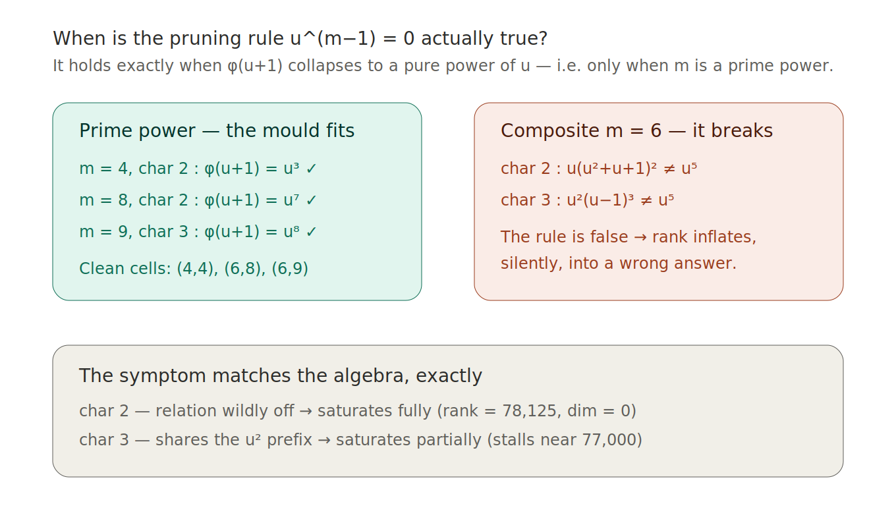

# The Prime-Power Reduction Frontier

### A wrong answer that was wrong in *two different ways* — and the boundary it revealed

> The cell `(6,6)` returned a number so impossible that it could not be dismissed as a bug. A bug fails the same way every time. This failure carried a fingerprint — and the fingerprint pointed to a precise line where the verification method silently breaks. This is the story of finding that line, naming it, and crossing it.

---

**The cell.** Fermat variety of dimension `n = 6`, degree `m = 6`. `DIM = (m−1)⁷ = 5⁷ = 78,125`. Split into `105` partitions.
**The verdict.** **PRIMITIVE** — by both primes dividing the degree, byte-exact, on a MacBook Air M2 with 8 GB of RAM.
**The numbers, from the run log only.** `dim_C = dim_F2 = dim_F3 = 59,392`. `rank_p = 18,733` in both characteristics.

---

## 1 · Why this cell was unlike any other before it

Every cell the campaign had conquered up to this point shared a hidden feature: its degree was a **power of a single prime**.

| earlier cell | degree m | = |
|---|---|---|
| (4,4), (6,8), (8,4) | 4, 8, 4 | 2² , 2³ , 2² |
| (6,5), (8,5) | 5 | prime |
| (6,7) | 7 | prime |
| (6,9) | 9 | 3² |

On every one of them, the prime-field engine worked flawlessly, cell after cell, byte for byte.

`(6,6)` is the first cell whose degree is a **product of two distinct primes**: `6 = 2 × 3`. And it is, by the campaign's own literature search, the **first composite-degree cell verified anywhere reachable** — because the entire published literature on lines and primitivity in Fermat varieties works in degrees that are *prime* or *coprime to 6*, and steers deliberately around exactly the degrees where both 2 and 3 divide `m`.

So `(6,6)` sat in a double blind spot: too deep in dimension for the computational tables, and forbidden in degree by the surface theory. Nobody had a number for it. The engine that had been right every previous time was about to be wrong — and the *way* it was wrong is the whole story.

---

## 2 · The anomaly — an impossible answer, impossible in two distinct ways

The engine that ran `(6,6)` — the SONIC / Jordan-mould lineage — had been right on every cell before it, byte for byte. So when it returned a number for `(6,6)`, the natural assumption was that the number was correct. It was not. And an independent uncompressed probe (`RELOJERO_DIAG_6_6`), written to double-check, returned the **same** impossible number, byte-exact. Two engines agreeing on nonsense. That ruled out a simple typo and left something stranger.

Look at what the two characteristics did:

**Characteristic 2.** The rank was nailed to `78,125` — the full ambient dimension — from **partition 1**, and never moved across all 105 partitions. That implies `dim_F2 = 0`. Impossible: the complex half `dim_C = 59,392` survives, so the ideal *cannot* fill the entire ring. The engine claimed the cycles span everything; the mathematics says they cannot.

**Characteristic 3.** A different failure entirely. The rank did **not** snap to full from the start — it *climbed*, partition by partition: `40,000 → 54,000 → … → 76,728` by partition 30, slowing, drifting toward roughly `77,000`. It never reached the true value (`18,733`), and never reached the full dimension (`78,125`) either. A **third wrong number**, stranded between the two.

Most people, faced with a wrong answer from working code, go hunting for the bug. The Architect did something else: he stopped and stared at the two wrong numbers side by side — and noticed they were wrong in *different ways*. That is the whole turning point of the investigation, and it is worth slowing down for:

> *If this were a generic "the echelon saturates for m = 6" bug, characteristics 2 and 3 would both saturate to 78,125 the same way. They do not. One saturates completely and instantly; the other crawls to a different wrong place. The two primes are behaving structurally differently — and a bug does not know which prime it is running in.*

A coding error is *prime-blind*: it would corrupt char 2 and char 3 identically. This corruption was *prime-aware* — it had a different shape in each field. That single observation flipped the entire problem. The fault was not in the code; it was in the **mathematics of the reduction itself**, and the gap between the two characteristics was not noise to be debugged away — it was a signpost, pointing straight at the cause.

---

## 3 · The forensic — two false trails, each killed with a number

Before the right answer, two plausible explanations were proposed and **measured to death** — recorded here because the dead trails are part of the rigor, not an embarrassment to hide.

**False trail 1 — "the monomial basis breaks when φ(1) = 0."** The defining polynomial `φ = 1 + t + ⋯ + t^(m−1)` satisfies `φ(1) = m`, which is `0` in any characteristic dividing `m`. Tempting to blame. **Refuted, byte-exact:** `φ` is monic of degree `m−1`, so `{1, t, …, t^(m−2)}` is a clean basis of `F_p[t]/(φ)` in *every* characteristic. `φ(1) = 0` does not damage the basis. Dead.

**False trail 2 — "the shift operator is cyclic and saturates."** Maybe the multiply-by-`(1+t)` operator behaves pathologically at `m = 6`. **Refuted, byte-exact:** the truncated shift `S` is a single clean nilpotent Jordan block, `(S − I)^(m−1) = 0`, in `(6,6)` char 2 **and** char 3 **and** char 5 — *structurally identical* to the clean cells `(4,4)`, `(6,8)`, `(6,9)`. The shift operator does not single out `(6,6)` at all. (An earlier reading — "one partition's closure already fills the space in char 2" — was a true *measurement* but a false *cause*: the shift is cyclic in every cell, so it cannot be what makes `(6,6)` special.) Logged and corrected without ego. Dead.

Two clean kills sharpened the question to its real form: *what does `m = 6` have that `m = 4, 5, 7, 8, 9` do not, and why does it hit char 2 and char 3 differently?*

---

## 4 · The diagnosis — the Frontier

The engines do their fast pruning in the **Jordan basis** `u = t − 1`. There, for a prime `p` dividing `m`, each variable was treated as nilpotent under the rule `u^(m−1) = 0`, and any term exceeding that ceiling was **never generated** — the structural non-generation that made the engines light and fast.

That rule is the *true* ring relation under one exact condition: that the defining polynomial, rewritten in `u`, collapses to a pure power of `u`.

> `φ(u + 1) = u^(m−1)`

So compute `φ(u + 1) = ((u+1)^m − 1) / u` over `F_p` and look:

| m | char p | φ(u+1) over F_p | pure power u^(m−1)? | the cell | engine behaviour |
|---|---|---|---|---|---|
| 4 | 2 | `u³` | **yes** | (4,4) | correct — clean |
| 8 | 2 | `u⁷` | **yes** | (6,8) | correct — clean |
| 9 | 3 | `u⁸` | **yes** | (6,9) | correct — clean |
| **6** | **2** | **`u·(u²+u+1)²`** | **no** | **(6,6)** | **WRONG — saturates fully** |
| **6** | **3** | **`u²·(u−1)³`** | **no** | **(6,6)** | **WRONG — saturates partially** |

There it is. **`φ(u + 1)` is a pure power of `u` if and only if `m` is a power of a single prime.** Every clean cell of the campaign — `m = 4, 5, 7, 8, 9` — is a prime power, which is *precisely why* the Jordan-mould was right every previous time. `(6,6)` is the first composite-`m` cell, and the first to step over the line.

When `m` has two or more distinct prime factors, `φ(u + 1)` does **not** collapse — it *factors*, a Chinese-Remainder splitting of the quotient ring into separate pieces. The pruning rule `u^(m−1) = 0` then imposes a relation that is **false**, injecting spurious relations that silently inflate the rank.

And now the prime-aware fingerprint from §2 explains itself **exactly**:

- **char 2:** the false rule is `u⁵ = 0` against the true `u·(u²+u+1)² = 0`. The false relation is wildly off — maximally destructive — so the rank saturates to `100%` (the `78,125` we saw from partition 1).
- **char 3:** the false rule `u⁵ = 0` against the true `u²·(u−1)³ = 0` — these **share the `u²` prefix**, so the corruption is partial. The rank saturates *partially*, crawling to a wrong intermediate (`~77,000`, matching the observed `76,728` at partition 30).
- **char 5:** coprime to 6, `φ` separable, no Jordan regime at all — perfectly clean.

The graded symptom — full / partial / clean — is reproduced from first principles by the factorizations. The diagnosis does not merely *fit* the data; it *predicts* the exact shape of all three behaviours. And it was reached **independently by two separate analyses** and confirmed byte-exact before a word of it was claimed.

We name this boundary — *the Jordan-mould reduction is valid if and only if `m` is a prime power* — **the prime-power reduction frontier**, henceforth, for brevity, **the Frontier**.



---

## 5 · What is new, and what is classical — fixed *before* the claim

This is the section that matters for honesty, and it was settled by searching the primary sources and their citation tree **before** anything was named — at the Architect's explicit instruction: *investigate what exists before claiming; step on no one's doorstep.*

**The underlying algebraic fact is classical, and is cited as such.** That `φ(u + 1)` is a pure power of `u` exactly when `m = pᵏ` is a known property of cyclotomic rings — the prime-power-conductor case is the "clean" case throughout the algebra of cyclotomic fields and lattice cryptography. **No claim is made on this fact.**

**What is genuinely new — and is the Architect's contribution:**

1. **Identifying that classical frontier as the exact point where the Hodge-verification reduction fails *silently*.** The hazard is not a crash — it is a plausible, wrong number. Pinning down *which* cells this corrupts, and proving *why the corruption is graded by characteristic* (the full/partial/clean signature), had not been done.
2. **Building the cure** (the ROSETTA engine), which crosses the Frontier and computes correctly for any degree.
3. **Verifying the first composite-degree cell** of the campaign, in a dimension and degree no published computation reaches.

**The name attaches to the frontier *of the method*, not to the classical fact.** Calling the cyclotomic identity "new" would be false priority. Naming the method-frontier — the precise line where *this verification reduction* breaks down — is honest and defensible.

**Where the published literature actually stands** (each verified against the primary source, not memory):

- **Degtyarev–Shimada (2016)** [1] give the criterion and verify it by computer up to a table that stops at `(8,3)`.
- **Aljovin–Movasati–Villaflor (2019)** [6] give a *theoretical* guarantee, but only when **"d prime, or d = 4, or gcd(d, (n+1)!) = 1"** — and `m = 6` satisfies *none* of these (not prime, not 4, and `gcd(6, 7!) ≠ 1` since `7!` contains both 2 and 3). Their implementation reaches only `n ≤ 4`.
- **For surfaces (n = 2)** — the problem originally posed by **Aoki and Shioda (1983)** [3] — the question is *fully settled*: Schütt–Shioda–van Luijk [4] and Degtyarev [5] proved the lines generate the Néron–Severi group **iff `m ≤ 4` or `gcd(m, 6) = 1`**. The surface literature works coprime to 6 by design.

There is a clean historical line here, worth seeing whole. Shioda asked in 1979 [2] whether the standard cycles generate the Hodge lattice of Fermat varieties; Aoki and Shioda made the surface case precise in 1983 [3]; the surface verdict was completed by Schütt–Shioda–van Luijk and Degtyarev; Degtyarev–Shimada turned the higher-dimensional question into a computable criterion in 2016 [1]. **This campaign is the next link in that chain** — taking the criterion into dimensions and degrees the chain had never reached, and finding, at `(6,6)`, that the computation itself has a frontier nobody had marked.

**The bisturí, stated plainly so no expert is misread:** the surface result says that for `m = 6` in **dimension 2**, the lines would *not* generate — `(6,6)` as a *surface* would fail. But the cell verified here is `n = 6, m = 6` — **dimension six, a fourfold's deeper cousin, not a surface.** A different regime entirely, where no such theorem applies and the question was genuinely open. The claim is about *this* high-dimensional cell, and it does not contradict the settled surface case.

*(Scope caveat, stated not hidden: this was a search of central and primary sources and their citation tree, not an exhaustive sweep of every journal. An obscure preprint could in principle anticipate it.)*

---

## 6 · The cure — ROSETTA STAR

The beautiful part of the fix is what it *keeps*. ROSETTA STAR retains **everything** that made the deep-cell engines fly — the turbine flow, the dense-rebound fold, the ~1-byte-per-entry varint store — and changes exactly **one thing**. Instead of pruning by the Jordan rule `u^(m−1) = 0`, it reduces in the **monomial basis** using the true ring relation, applied explicitly on every shift:

> `t^(m−1) ≡ −(1 + t + t² + ⋯ + t^(m−2))`

Same ideal, same ring, same quotient. But this relation is correct for **any** degree — prime-power or composite — because it makes no assumption about how `φ` factors. The only two functions that changed from the previous engine are the generator construction and the shift; the entire reduction machinery is byte-identical.

It earned its name the hard way, against known cells, *before* being trusted on the unknown one:

| gate cell | char | rank | dim | matches |
|---|---|---|---|---|
| (4,4) | 2 | 141 | 102 | Degtyarev–Shimada |
| (8,3) | 3 | 252 | 260 | Degtyarev–Shimada |

Only after both gates passed byte-exact was ROSETTA pointed at `(6,6)`.

---

## 7 · The verdict — from the log, and nowhere else

From `ROSETTA_STAR_6_6_run1.log`:

```
==== char 2 ====
  rank_p = 18,733   dim_F2 = 59,392   peak 0.47 GB   t =  6,551 s   (part 105/105)
==== char 3 ====
  rank_p = 18,733   dim_F3 = 59,392   peak 0.60 GB   t = 11,532 s   (part 105/105)

dim_C  = 59,392   (complex half, cross-prime)
dim_F2 = 59,392
dim_F3 = 59,392
VERDICT = PRIMITIVE
```

And here is the signature that turns a number into a proof. The two characteristics did not merely *arrive* at the same answer — they **walked there in lockstep, partition by partition**: at partition 17, rank `5,905` in both; at partition 21, rank `7,201` in both; … and at partition 105, rank `18,733` in both. Two independent primes tracing the *identical* curve, checkpoint by checkpoint, is the fingerprint of *equal ideal dimension in both fields*, which is the fingerprint of **primitivity**. The broken engine had said `78,125` (saturated garbage); ROSETTA said `18,733` (the truth); and the complex half, computed by a wholly independent method over five primes, agreed to the digit.

Peak RAM: **0.47 GB and 0.60 GB** — a fraction of the 5.4 GB guard. No swap. The SSD never touched. The first composite-degree cell of the campaign, decided on an 8 GB laptop, by two primes and two independent methods that agree exactly.

*Check it yourself:* the engine is [`engines/ROSETTA_STAR.cpp`](engines/ROSETTA_STAR.cpp) and the full run output is [`logs/ROSETTA_STAR_6_6_run1.log`](logs/ROSETTA_STAR_6_6_run1.log). Build it, run `./ROSETTA_STAR 6 6`, and watch the two characteristics climb in lockstep to 18,733.

---

## 8 · Why it matters

The Frontier is not just the explanation of one wrong answer — it **redraws the map of the campaign.** It predicts, with no further computation, exactly which future cells need the monomial engine and which can keep the fast Jordan lineage:

| degree m | type | engine the Frontier prescribes |
|---|---|---|
| 4, 8, 9, 16, 25, … | prime power | fast Jordan lineage (the mould is valid) |
| **6, 10, 12, 14, 15, …** | **composite** | **ROSETTA** (monomial reduction required) |

And it stands as a warning to anyone running this class of verification. A silent wrong answer in a forbidden degree is more dangerous than a crash, because it *looks like a result* — it would have entered a table as `dim = 0` and corrupted everything downstream. Knowing precisely where the method's floor gives way is part of what makes its answers trustworthy *everywhere else*.

A note on how this was held to account, because it is the spine of the whole thing: the diagnosis above explained every symptom and was reached independently twice — and it was still treated as a *hypothesis*, not a result, until ROSETTA actually ran `(6,6)` and returned `18,733` in both primes, byte-exact. A consistent story is not a proof. The corrected run is the proof. Every number in this document comes from a log; none from memory.

With that discipline behind it, here is what stands. A psychologist with no formal mathematical training, working on a consumer laptop, took a verification method into a degree the literature has avoided for forty years — and not only got the right answer where the standard engine produced silent garbage, but found and named the exact mathematical line where that garbage is born. The bricks confirming the conjecture-side of the criterion now span degrees `m = 3, 4, 5, 6, 7, 8, 9`, and `m = 6` is the first **composite** one: the cell the field circles around, decided clean, on 8 GB of consumer memory, by two primes walking in perfect lockstep. The method now has a boundary, and the boundary has a name.

---

## References

1. A. Degtyarev, I. Shimada, *On the topology of projective subspaces in complex Fermat varieties.* J. Math. Soc. Japan **68**:3 (2016), 975–996. arXiv:1405.4683.
2. T. Shioda, *The Hodge conjecture for Fermat varieties.* Math. Ann. **245** (1979), 175–184.
3. N. Aoki, T. Shioda, *Generators of the Néron–Severi group of a Fermat surface.* In: Arithmetic and Geometry (M. Artin, J. Tate, eds.), Progress in Mathematics **35**, Birkhäuser, Boston (1983), 1–12.
4. M. Schütt, T. Shioda, R. van Luijk, *Lines on Fermat surfaces.* J. Number Theory **130**:9 (2010), 1939–1963. arXiv:0812.2377.
5. A. Degtyarev, *Lines generate the Picard groups of certain Fermat surfaces.* arXiv:1305.3073.
6. E. Aljovin, H. Movasati, R. Villaflor, *Integral Hodge conjecture for Fermat varieties.* J. Symbolic Computation **95** (2019), 177–184. arXiv:1711.02628.
